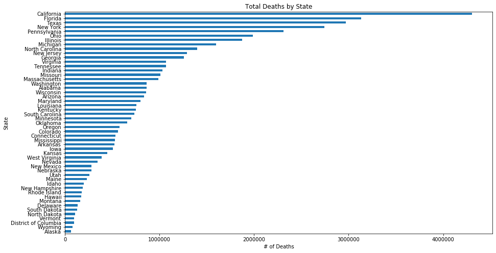
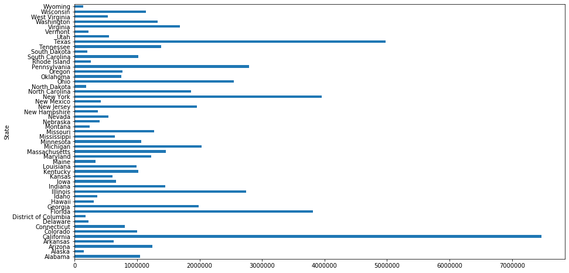
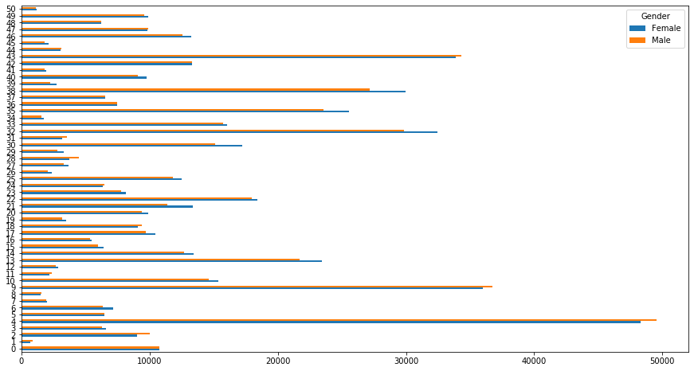
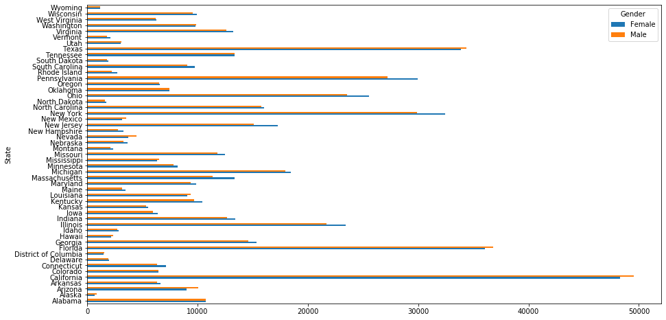
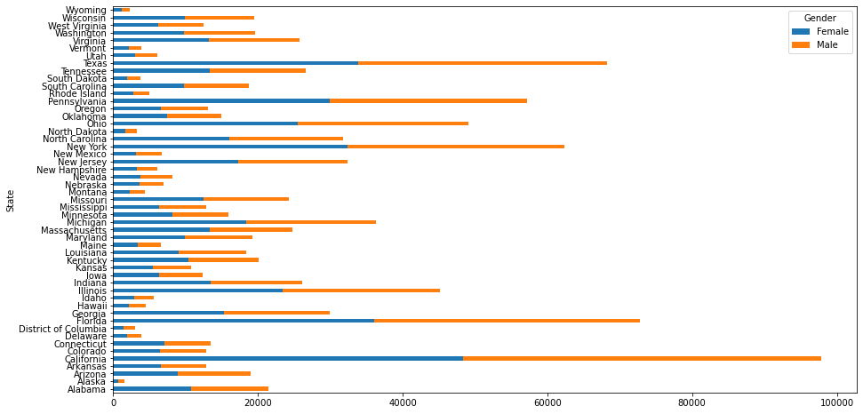

# Pivot Tables with Pandas - Lab

## Introduction

In this lab, use pivot tables with real-world data.  

## Objectives

In this lab you will:

- Describe what is meant by long and wide format data 
- Use multi-hierarchical indexing to access aggregated data 
- Use pivot to create a more organized aggregated DataFrame 
- Use stack and unstack to move between different level of multi-indexing 

## Getting Started

In the cell below:

* Import `pandas` and set the standard alias   
* Import `matplotlib.pyplot` and set the standard alias   
* Run the iPython magic command to display matplotlib graphs inline within the notebook


```python

```


```python
# __SOLUTION__
import pandas as pd
import matplotlib.pyplot as plt

%matplotlib inline
```

## Load the data
The data for this activity is stored in a file called `'causes_of_death.tsv'` which is a somewhat morbid dataset from the center for disease control. Note that the file extension .tsv indicates that this data is formatted slightly differently then the standard .csv, the difference being that it has 'tab separated values' instead of 'comma separated values'. As such, pass in the optional parameter `delimiter='\t'` into the `pd.read_csv()` function.


```python
df = None
```


```python
# __SOLUTION__
df = pd.read_csv("causes_of_death.tsv", delimiter="\t")
```

Now, display the head of the DataFrame to ensure everything loaded correctly.


```python
# Your code here
```


```python
# __SOLUTION__
df.head()
```


<div>
<style scoped>
    .dataframe tbody tr th:only-of-type {
        vertical-align: middle;
    }

    .dataframe tbody tr th {
        vertical-align: top;
    }

    .dataframe thead th {
        text-align: right;
    }
</style>
<table border="1" class="dataframe">
  <thead>
    <tr style="text-align: right;">
      <th></th>
      <th>Notes</th>
      <th>State</th>
      <th>State Code</th>
      <th>Ten-Year Age Groups</th>
      <th>Ten-Year Age Groups Code</th>
      <th>Gender</th>
      <th>Gender Code</th>
      <th>Race</th>
      <th>Race Code</th>
      <th>Deaths</th>
      <th>Population</th>
      <th>Crude Rate</th>
    </tr>
  </thead>
  <tbody>
    <tr>
      <th>0</th>
      <td>NaN</td>
      <td>Alabama</td>
      <td>1</td>
      <td>&lt; 1 year</td>
      <td>1</td>
      <td>Female</td>
      <td>F</td>
      <td>American Indian or Alaska Native</td>
      <td>1002-5</td>
      <td>14</td>
      <td>3579</td>
      <td>Unreliable</td>
    </tr>
    <tr>
      <th>1</th>
      <td>NaN</td>
      <td>Alabama</td>
      <td>1</td>
      <td>&lt; 1 year</td>
      <td>1</td>
      <td>Female</td>
      <td>F</td>
      <td>Asian or Pacific Islander</td>
      <td>A-PI</td>
      <td>24</td>
      <td>7443</td>
      <td>322.5</td>
    </tr>
    <tr>
      <th>2</th>
      <td>NaN</td>
      <td>Alabama</td>
      <td>1</td>
      <td>&lt; 1 year</td>
      <td>1</td>
      <td>Female</td>
      <td>F</td>
      <td>Black or African American</td>
      <td>2054-5</td>
      <td>2093</td>
      <td>169339</td>
      <td>1236.0</td>
    </tr>
    <tr>
      <th>3</th>
      <td>NaN</td>
      <td>Alabama</td>
      <td>1</td>
      <td>&lt; 1 year</td>
      <td>1</td>
      <td>Female</td>
      <td>F</td>
      <td>White</td>
      <td>2106-3</td>
      <td>2144</td>
      <td>347921</td>
      <td>616.2</td>
    </tr>
    <tr>
      <th>4</th>
      <td>NaN</td>
      <td>Alabama</td>
      <td>1</td>
      <td>&lt; 1 year</td>
      <td>1</td>
      <td>Male</td>
      <td>M</td>
      <td>Asian or Pacific Islander</td>
      <td>A-PI</td>
      <td>33</td>
      <td>7366</td>
      <td>448.0</td>
    </tr>
  </tbody>
</table>
</div>


Our data is currently in **_Wide_** format.  We can tidy this up by converting it to **_Long_** format by using groupby statements to aggregate our data into a much neater, more readable format. 

## Groupby aggregations

Complete the following groupby statements.

- Groupby `State` and `Gender`. Sum the values.


```python
# Your code here
```


```python
# __SOLUTION__
# Your code here
df.groupby(["State", "Gender"])["Deaths"].sum().head()
```


    State    Gender
    Alabama  Female    430133
             Male      430647
    Alaska   Female     27199
             Male       36135
    Arizona  Female    396028
    Name: Deaths, dtype: int64


- Groupby `State`, `Gender`, and `Race`. Find the average values.


```python
# Your code here
```


```python
# __SOLUTION__
# Your code here
df.groupby(["State", "Gender", "Race"])["Deaths"].mean().head()
```


    State    Gender  Race                            
    Alabama  Female  American Indian or Alaska Native       70.875000
                     Asian or Pacific Islander              95.500000
                     Black or African American            9074.000000
                     White                               29890.636364
             Male    American Indian or Alaska Native       86.375000
    Name: Deaths, dtype: float64


- Groupby `Gender` and `Race`. Find the minimum values.


```python
# Your code here
```


```python
# __SOLUTION__
# Your code here
df.groupby(["Gender", "Race"]).min().head()
```


<div>
<style scoped>
    .dataframe tbody tr th:only-of-type {
        vertical-align: middle;
    }

    .dataframe tbody tr th {
        vertical-align: top;
    }

    .dataframe thead th {
        text-align: right;
    }
</style>
<table border="1" class="dataframe">
  <thead>
    <tr style="text-align: right;">
      <th></th>
      <th></th>
      <th>Notes</th>
      <th>State</th>
      <th>State Code</th>
      <th>Ten-Year Age Groups</th>
      <th>Ten-Year Age Groups Code</th>
      <th>Gender Code</th>
      <th>Race Code</th>
      <th>Deaths</th>
      <th>Population</th>
      <th>Crude Rate</th>
    </tr>
    <tr>
      <th>Gender</th>
      <th>Race</th>
      <th></th>
      <th></th>
      <th></th>
      <th></th>
      <th></th>
      <th></th>
      <th></th>
      <th></th>
      <th></th>
      <th></th>
    </tr>
  </thead>
  <tbody>
    <tr>
      <th rowspan="4" valign="top">Female</th>
      <th>American Indian or Alaska Native</th>
      <td>NaN</td>
      <td>Alabama</td>
      <td>1</td>
      <td>1-4 years</td>
      <td>1</td>
      <td>F</td>
      <td>1002-5</td>
      <td>10</td>
      <td>100285</td>
      <td>10.4</td>
    </tr>
    <tr>
      <th>Asian or Pacific Islander</th>
      <td>NaN</td>
      <td>Alabama</td>
      <td>1</td>
      <td>1-4 years</td>
      <td>1</td>
      <td>F</td>
      <td>A-PI</td>
      <td>10</td>
      <td>100371</td>
      <td>10.1</td>
    </tr>
    <tr>
      <th>Black or African American</th>
      <td>NaN</td>
      <td>Alabama</td>
      <td>1</td>
      <td>1-4 years</td>
      <td>1</td>
      <td>F</td>
      <td>2054-5</td>
      <td>10</td>
      <td>100170</td>
      <td>100.3</td>
    </tr>
    <tr>
      <th>White</th>
      <td>NaN</td>
      <td>Alabama</td>
      <td>1</td>
      <td>1-4 years</td>
      <td>1</td>
      <td>F</td>
      <td>2106-3</td>
      <td>12</td>
      <td>1000704</td>
      <td>10.1</td>
    </tr>
    <tr>
      <th>Male</th>
      <th>American Indian or Alaska Native</th>
      <td>NaN</td>
      <td>Alabama</td>
      <td>1</td>
      <td>1-4 years</td>
      <td>1</td>
      <td>M</td>
      <td>1002-5</td>
      <td>10</td>
      <td>1001</td>
      <td>10000.0</td>
    </tr>
  </tbody>
</table>
</div>


Create a bar chart of the total number of deaths by state: 

* Sort your columns in order (ascending or descending are both acceptable).  
* Also make sure to include a title, axes labels and have your graph be an appropriate size.

**_NOTE:_** In order to do this, slice the `Deaths` column after the `.groupby()` method, but before the `.sum()` method.  You can even chain the `.plot()` method on after the `.sum()` method and do this all on one line, excluding the labeling of the graph.


```python
# Your code here
```


```python
# __SOLUTION__
# Your code here
df.groupby(["State"])["Deaths"].sum().sort_values().plot(kind="barh", figsize=(15, 8))
plt.title("Total Deaths by State")
plt.xlabel("# of Deaths")
```


    Text(0.5, 0, '# of Deaths')


    

    


### Inspecting our data

Let's go one step further and print the data type of each column. 

In the cell below, use the `.info()` method of the DataFrame, and note the data type that each column is currently stored as.  


```python

```


```python
# __SOLUTION__
df.info()
```

    <class 'pandas.core.frame.DataFrame'>
    RangeIndex: 4115 entries, 0 to 4114
    Data columns (total 12 columns):
     #   Column                    Non-Null Count  Dtype  
    ---  ------                    --------------  -----  
     0   Notes                     0 non-null      float64
     1   State                     4115 non-null   object 
     2   State Code                4115 non-null   int64  
     3   Ten-Year Age Groups       4115 non-null   object 
     4   Ten-Year Age Groups Code  4115 non-null   object 
     5   Gender                    4115 non-null   object 
     6   Gender Code               4115 non-null   object 
     7   Race                      4115 non-null   object 
     8   Race Code                 4115 non-null   object 
     9   Deaths                    4115 non-null   int64  
     10  Population                4115 non-null   object 
     11  Crude Rate                4115 non-null   object 
    dtypes: float64(1), int64(2), object(9)
    memory usage: 385.9+ KB


Let's look at some samples from the `Population` column to see if the current encoding seems appropriate for the data it contains. 

In the cell below, display the population values for the first 5 rows in the DataFrame.  


```python

```


```python
# __SOLUTION__
df.Population.iloc[:5]
```


    0      3579
    1      7443
    2    169339
    3    347921
    4      7366
    Name: Population, dtype: object


Just to be extra sure, let's check the value counts to see how many times each unique value shows up in the dataset. We'll only look at the top 5. 

In the cell below, print out the top 5 `value_counts()` of the population column of the DataFrame. 


```python

```


```python
# __SOLUTION__
df.Population.value_counts()[:5]
```


    Not Applicable    75
    2777               2
    16653              2
    3240               2
    907                2
    Name: Population, dtype: int64


Clearly, this data should be stored as a numeric type, not a categorical type.  
 
### Reformat the `Population` column as an integer
As it stands, not all values can be reformated as integers. Most of the cells in the `Population` column contain integer values, but the entire column is currently encoded in string format because some cells contain the string `'Not Applicable'`.

We need to remove these rows before we can cast the `Population` column to an integer data type. 

In the cell below:

* Slice the rows of `df` where the `Population` column is equal to `'Not Applicable'`  
* Use `to_drop.index` to drop the offending rows from `df`. Be sure to set the `axis=0`, and `inplace=True`  
* Cast the `Population` column to an integer data type using the `.astype()` method, with the single parameter `int64` passed in  
* Print the `Population` column's `dtype` attribute to confirm it is now stored in `int64` format  


**_NOTE:_** `.astype()` returns a copy of the column, so make sure you set the Population column equal to what this method returns--don't just call it.


```python
# Your code here
to_drop = None
```


```python
# __SOLUTION__
# Your code here
to_drop = df[df["Population"] == "Not Applicable"]
df.drop(to_drop.index, axis=0, inplace=True)
df["Population"] = df["Population"].astype("int64")
print(df["Population"].dtype)
```

    int64


### Complete the bar chart

Now that we've reformatted our data, let's create a bar chart of the mean `Population` by `State`. 


```python
# Your code here
```


```python
# __SOLUTION__
# Your code here
df.groupby("State")["Population"].mean().plot(kind="barh", figsize=(15, 8))
```


    <AxesSubplot:ylabel='State'>


    

    


Below we will investigate how we can combine the `.pivot()` method along with the `.groupby()` method to combine some cool **stacked bar charts**.

## Use aggregate methods

In the cell below:

* Group `df` by `'State'` and  `'Gender'`, and then slice both `'Deaths'` and `'Population'` from it. Chain the `.agg()` method to return the mean, min, max, and standard deviation of these sliced columns. 

**_NOTE:_** This only requires one line of code.  

By now, you've probably caught on that the code required to do this follows this pattern:    `([things to group by])[columns to slice].agg([aggregates to return])`

Then, display the `.head()` of this new DataFrame.


```python
# Your code here
grouped = None
```


```python
# __SOLUTION__
# Your code here
grouped = df.groupby(["State", "Gender"])[["Deaths", "Population"]].agg(
    ["mean", "min", "max", "std"]
)
grouped.head()
```

    <ipython-input-13-58bdc6161645>:3: FutureWarning: Indexing with multiple keys (implicitly converted to a tuple of keys) will be deprecated, use a list instead.
      grouped = df.groupby(['State', 'Gender'])['Deaths',


<div>
<style scoped>
    .dataframe tbody tr th:only-of-type {
        vertical-align: middle;
    }

    .dataframe tbody tr th {
        vertical-align: top;
    }

    .dataframe thead tr th {
        text-align: left;
    }

    .dataframe thead tr:last-of-type th {
        text-align: right;
    }
</style>
<table border="1" class="dataframe">
  <thead>
    <tr>
      <th></th>
      <th></th>
      <th colspan="4" halign="left">Deaths</th>
      <th colspan="4" halign="left">Population</th>
    </tr>
    <tr>
      <th></th>
      <th></th>
      <th>mean</th>
      <th>min</th>
      <th>max</th>
      <th>std</th>
      <th>mean</th>
      <th>min</th>
      <th>max</th>
      <th>std</th>
    </tr>
    <tr>
      <th>State</th>
      <th>Gender</th>
      <th></th>
      <th></th>
      <th></th>
      <th></th>
      <th></th>
      <th></th>
      <th></th>
      <th></th>
    </tr>
  </thead>
  <tbody>
    <tr>
      <th rowspan="2" valign="top">Alabama</th>
      <th>Female</th>
      <td>10753.325000</td>
      <td>10</td>
      <td>116297</td>
      <td>24612.250487</td>
      <td>1.078713e+06</td>
      <td>2087</td>
      <td>4334752</td>
      <td>1.400309e+06</td>
    </tr>
    <tr>
      <th>Male</th>
      <td>10765.850000</td>
      <td>10</td>
      <td>88930</td>
      <td>20813.538537</td>
      <td>1.014946e+06</td>
      <td>1129</td>
      <td>4284775</td>
      <td>1.397830e+06</td>
    </tr>
    <tr>
      <th rowspan="2" valign="top">Alaska</th>
      <th>Female</th>
      <td>679.975000</td>
      <td>13</td>
      <td>4727</td>
      <td>1154.870455</td>
      <td>1.440403e+05</td>
      <td>1224</td>
      <td>682855</td>
      <td>2.015793e+05</td>
    </tr>
    <tr>
      <th>Male</th>
      <td>860.357143</td>
      <td>12</td>
      <td>5185</td>
      <td>1411.777392</td>
      <td>1.518884e+05</td>
      <td>578</td>
      <td>770502</td>
      <td>2.238843e+05</td>
    </tr>
    <tr>
      <th>Arizona</th>
      <th>Female</th>
      <td>8998.386364</td>
      <td>21</td>
      <td>133923</td>
      <td>26245.941003</td>
      <td>1.246502e+06</td>
      <td>12211</td>
      <td>6265346</td>
      <td>2.096632e+06</td>
    </tr>
  </tbody>
</table>
</div>


Note how Pandas denotes a multi-hierarchical index in the DataFrame above.  

Let's inspect how a multi-hierarchical index is actually stored.  

In the cell below, display the `index` attribute of this DataFrame. 


```python

```


```python
# __SOLUTION__
grouped.index
```


    MultiIndex([(      'Alabama', 'Female'),
                (      'Alabama',   'Male'),
                (       'Alaska', 'Female'),
                (       'Alaska',   'Male'),
                (      'Arizona', 'Female'),
                (      'Arizona',   'Male'),
                (     'Arkansas', 'Female'),
                (     'Arkansas',   'Male'),
                (   'California', 'Female'),
                (   'California',   'Male'),
                ...
                (     'Virginia', 'Female'),
                (     'Virginia',   'Male'),
                (   'Washington', 'Female'),
                (   'Washington',   'Male'),
                ('West Virginia', 'Female'),
                ('West Virginia',   'Male'),
                (    'Wisconsin', 'Female'),
                (    'Wisconsin',   'Male'),
                (      'Wyoming', 'Female'),
                (      'Wyoming',   'Male')],
               names=['State', 'Gender'], length=102)


A two-dimensional array denotes the multiple levels, with each possible combination being a row in our `grouped` DataFrame.  

Let's reset the index, and then see how it changes. 

In the cell below, call the DataFrame's `.reset_index()` method.  Then, display the `.head()` of the DataFrame.  


```python
# First, reset the index. Notice the subtle difference; State and Gender are now columns rather than the index
grouped = None
```


```python
# __SOLUTION__
# First, reset the index. Notice the subtle difference; State and Gender are now columns rather than the index
grouped = grouped.reset_index()
grouped.head()
```


<div>
<style scoped>
    .dataframe tbody tr th:only-of-type {
        vertical-align: middle;
    }

    .dataframe tbody tr th {
        vertical-align: top;
    }

    .dataframe thead tr th {
        text-align: left;
    }
</style>
<table border="1" class="dataframe">
  <thead>
    <tr>
      <th></th>
      <th>State</th>
      <th>Gender</th>
      <th colspan="4" halign="left">Deaths</th>
      <th colspan="4" halign="left">Population</th>
    </tr>
    <tr>
      <th></th>
      <th></th>
      <th></th>
      <th>mean</th>
      <th>min</th>
      <th>max</th>
      <th>std</th>
      <th>mean</th>
      <th>min</th>
      <th>max</th>
      <th>std</th>
    </tr>
  </thead>
  <tbody>
    <tr>
      <th>0</th>
      <td>Alabama</td>
      <td>Female</td>
      <td>10753.325000</td>
      <td>10</td>
      <td>116297</td>
      <td>24612.250487</td>
      <td>1.078713e+06</td>
      <td>2087</td>
      <td>4334752</td>
      <td>1.400309e+06</td>
    </tr>
    <tr>
      <th>1</th>
      <td>Alabama</td>
      <td>Male</td>
      <td>10765.850000</td>
      <td>10</td>
      <td>88930</td>
      <td>20813.538537</td>
      <td>1.014946e+06</td>
      <td>1129</td>
      <td>4284775</td>
      <td>1.397830e+06</td>
    </tr>
    <tr>
      <th>2</th>
      <td>Alaska</td>
      <td>Female</td>
      <td>679.975000</td>
      <td>13</td>
      <td>4727</td>
      <td>1154.870455</td>
      <td>1.440403e+05</td>
      <td>1224</td>
      <td>682855</td>
      <td>2.015793e+05</td>
    </tr>
    <tr>
      <th>3</th>
      <td>Alaska</td>
      <td>Male</td>
      <td>860.357143</td>
      <td>12</td>
      <td>5185</td>
      <td>1411.777392</td>
      <td>1.518884e+05</td>
      <td>578</td>
      <td>770502</td>
      <td>2.238843e+05</td>
    </tr>
    <tr>
      <th>4</th>
      <td>Arizona</td>
      <td>Female</td>
      <td>8998.386364</td>
      <td>21</td>
      <td>133923</td>
      <td>26245.941003</td>
      <td>1.246502e+06</td>
      <td>12211</td>
      <td>6265346</td>
      <td>2.096632e+06</td>
    </tr>
  </tbody>
</table>
</div>


Note how the way index is displayed has changed.  The index columns that made up the multi-hierarchical index before are now stored as columns of data, with each row given a more traditional numerical index. 

Let's confirm this by reexamining the `index` attribute of `grouped` in the cell below.


```python

```


```python
# __SOLUTION__
grouped.index
```


    RangeIndex(start=0, stop=102, step=1)


However, look again at the displayed DataFrame -- specifically, the columns. Resetting the index has caused the DataFrame to use a multi-indexed structure for the columns. 

In the cell below, examine the `columns` attribute of `grouped` to confirm this. 


```python
# Notice that this causes columns to be MultiIndexed
```


```python
# __SOLUTION__
# Notice that this causes columns to be MultiIndexed
grouped.columns
```


    MultiIndex([(     'State',     ''),
                (    'Gender',     ''),
                (    'Deaths', 'mean'),
                (    'Deaths',  'min'),
                (    'Deaths',  'max'),
                (    'Deaths',  'std'),
                ('Population', 'mean'),
                ('Population',  'min'),
                ('Population',  'max'),
                ('Population',  'std')],
               )


### Column levels

Since we're working with multi-hierarchical indices, we can examine the indices available at each level.

In the cell below, use the `.get_level_values()` method contained within the DataFrame's `columns` attribute to get the values for the outermost layer of the index. 


```python

```


```python
# __SOLUTION__
grouped.columns.get_level_values(0)
```


    Index(['State', 'Gender', 'Deaths', 'Deaths', 'Deaths', 'Deaths', 'Population',
           'Population', 'Population', 'Population'],
          dtype='object')


Now, get the level values for the inner layer of the index. 


```python

```


```python
# __SOLUTION__
grouped.columns.get_level_values(1)
```


    Index(['', '', 'mean', 'min', 'max', 'std', 'mean', 'min', 'max', 'std'], dtype='object')


## Flattening the DataFrame

We can also **_flatten_** the DataFrame from a multi-hierarchical index to a more traditional one-dimensional index.  We do this by creating each unique combination possible of every level of the multi-hierarchical index.  Since this is a complex task, you do not need to write it -- but take some time to examine the code in the cell below and see if you can understand how it works. 


```python
# We could also flatten these:
cols0 = grouped.columns.get_level_values(0)
cols1 = grouped.columns.get_level_values(1)
grouped.columns = [
    col0 + "_" + col1 if col1 != "" else col0 for col0, col1 in list(zip(cols0, cols1))
]
# The list comprehension above is more complicated then what we need but creates a nicer formatting and
# demonstrates using a conditional within a list comprehension.
# This simpler version works but has some tail underscores where col1 is blank:
# grouped.columns = [col0 + '_' + col1 for col0, col1 in list(zip(cols0, cols1))]
grouped.columns
```


```python
# __SOLUTION__
# We could also flatten these:
cols0 = grouped.columns.get_level_values(0)
cols1 = grouped.columns.get_level_values(1)
grouped.columns = [
    col0 + "_" + col1 if col1 != "" else col0 for col0, col1 in list(zip(cols0, cols1))
]
# The list comprehension above is more complicated then what we need but creates a nicer formatting and
# demonstrates using a conditional within a list comprehension.
# This simpler version works but has some tail underscores where col1 is blank:
# grouped.columns = [col0 + '_' + col1 for col0, col1 in list(zip(cols0, cols1))]
grouped.columns
```


    Index(['State', 'Gender', 'Deaths_mean', 'Deaths_min', 'Deaths_max',
           'Deaths_std', 'Population_mean', 'Population_min', 'Population_max',
           'Population_std'],
          dtype='object')


Now that we've flattened the DataFrame, let's inspect a couple rows to see what it looks like. 

In the cell below, inspect the `.head()` of the `grouped` DataFrame. 


```python

```


```python
# __SOLUTION__
grouped.head()
```


<div>
<style scoped>
    .dataframe tbody tr th:only-of-type {
        vertical-align: middle;
    }

    .dataframe tbody tr th {
        vertical-align: top;
    }

    .dataframe thead th {
        text-align: right;
    }
</style>
<table border="1" class="dataframe">
  <thead>
    <tr style="text-align: right;">
      <th></th>
      <th>State</th>
      <th>Gender</th>
      <th>Deaths_mean</th>
      <th>Deaths_min</th>
      <th>Deaths_max</th>
      <th>Deaths_std</th>
      <th>Population_mean</th>
      <th>Population_min</th>
      <th>Population_max</th>
      <th>Population_std</th>
    </tr>
  </thead>
  <tbody>
    <tr>
      <th>0</th>
      <td>Alabama</td>
      <td>Female</td>
      <td>10753.325000</td>
      <td>10</td>
      <td>116297</td>
      <td>24612.250487</td>
      <td>1.078713e+06</td>
      <td>2087</td>
      <td>4334752</td>
      <td>1.400309e+06</td>
    </tr>
    <tr>
      <th>1</th>
      <td>Alabama</td>
      <td>Male</td>
      <td>10765.850000</td>
      <td>10</td>
      <td>88930</td>
      <td>20813.538537</td>
      <td>1.014946e+06</td>
      <td>1129</td>
      <td>4284775</td>
      <td>1.397830e+06</td>
    </tr>
    <tr>
      <th>2</th>
      <td>Alaska</td>
      <td>Female</td>
      <td>679.975000</td>
      <td>13</td>
      <td>4727</td>
      <td>1154.870455</td>
      <td>1.440403e+05</td>
      <td>1224</td>
      <td>682855</td>
      <td>2.015793e+05</td>
    </tr>
    <tr>
      <th>3</th>
      <td>Alaska</td>
      <td>Male</td>
      <td>860.357143</td>
      <td>12</td>
      <td>5185</td>
      <td>1411.777392</td>
      <td>1.518884e+05</td>
      <td>578</td>
      <td>770502</td>
      <td>2.238843e+05</td>
    </tr>
    <tr>
      <th>4</th>
      <td>Arizona</td>
      <td>Female</td>
      <td>8998.386364</td>
      <td>21</td>
      <td>133923</td>
      <td>26245.941003</td>
      <td>1.246502e+06</td>
      <td>12211</td>
      <td>6265346</td>
      <td>2.096632e+06</td>
    </tr>
  </tbody>
</table>
</div>


## Using pivots

Now, we'll gain some practice using the DataFrame's built-in `.pivot()` method.  

In the cell below, call the DataFrame's `.pivot()` method with the following parameters:

* index = `'State'`
* columns = `'Gender'`
* values = `'Deaths_mean'`

Then, display the `.head()` of our new `pivot` DataFrame to see what it looks like. 


```python
# Now it's time to pivot
pivot = None
```


```python
# __SOLUTION__
# Now it's time to pivot
pivot = grouped.pivot(index="State", columns="Gender", values="Deaths_mean")
pivot.head()
```


<div>
<style scoped>
    .dataframe tbody tr th:only-of-type {
        vertical-align: middle;
    }

    .dataframe tbody tr th {
        vertical-align: top;
    }

    .dataframe thead th {
        text-align: right;
    }
</style>
<table border="1" class="dataframe">
  <thead>
    <tr style="text-align: right;">
      <th>Gender</th>
      <th>Female</th>
      <th>Male</th>
    </tr>
    <tr>
      <th>State</th>
      <th></th>
      <th></th>
    </tr>
  </thead>
  <tbody>
    <tr>
      <th>Alabama</th>
      <td>10753.325000</td>
      <td>10765.850000</td>
    </tr>
    <tr>
      <th>Alaska</th>
      <td>679.975000</td>
      <td>860.357143</td>
    </tr>
    <tr>
      <th>Arizona</th>
      <td>8998.386364</td>
      <td>10036.204545</td>
    </tr>
    <tr>
      <th>Arkansas</th>
      <td>6621.615385</td>
      <td>6301.690476</td>
    </tr>
    <tr>
      <th>California</th>
      <td>48312.840909</td>
      <td>49555.522727</td>
    </tr>
  </tbody>
</table>
</div>


We've just created a pivot table.  

Let's reset the index and see how it changes our pivot table. 

In the cell below, reset the index of the `pivot` object as we did previously.  Then, display the `.head()` of the object to see if we can detect any changes.


```python
# Again, notice the subtle difference of resetting the index:
pivot = None
```


```python
# __SOLUTION__
# Again, notice the subtle difference of resetting the index:
pivot = pivot.reset_index()
pivot.head()
```


<div>
<style scoped>
    .dataframe tbody tr th:only-of-type {
        vertical-align: middle;
    }

    .dataframe tbody tr th {
        vertical-align: top;
    }

    .dataframe thead th {
        text-align: right;
    }
</style>
<table border="1" class="dataframe">
  <thead>
    <tr style="text-align: right;">
      <th>Gender</th>
      <th>State</th>
      <th>Female</th>
      <th>Male</th>
    </tr>
  </thead>
  <tbody>
    <tr>
      <th>0</th>
      <td>Alabama</td>
      <td>10753.325000</td>
      <td>10765.850000</td>
    </tr>
    <tr>
      <th>1</th>
      <td>Alaska</td>
      <td>679.975000</td>
      <td>860.357143</td>
    </tr>
    <tr>
      <th>2</th>
      <td>Arizona</td>
      <td>8998.386364</td>
      <td>10036.204545</td>
    </tr>
    <tr>
      <th>3</th>
      <td>Arkansas</td>
      <td>6621.615385</td>
      <td>6301.690476</td>
    </tr>
    <tr>
      <th>4</th>
      <td>California</td>
      <td>48312.840909</td>
      <td>49555.522727</td>
    </tr>
  </tbody>
</table>
</div>


### Visualizing Data With Pivot Tables

Now, we'll make use of our newly created pivot table to quickly create some visualizations of our data.  

In the cell below, call `pivot.plot()` with the following parameters:

* kind = `'barh'`
* figsize = `(15,8)`


```python
# Now let's make a sweet bar chart
```


```python
# __SOLUTION__
# Now let's make a sweet bar chart
pivot.plot(kind="barh", figsize=(15, 8))
```


    <AxesSubplot:>


    

    


Notice the Y-axis is currently just a list of numbers.  That's because when we reset the index, it defaulted to assigning integers as the index for the DataFrame.  Let's set the index back to `'State'`, and then recreate the visualization. 

In the cell below:

* Use the `pivot` object's `.set_index()` method and set the index to `'State'`.  Then, chain this with a `.plot()` call to recreate the visualization using the code we used in the cell above.  

All the code in this cell should be done in a single line.  Just call the methods -- do not rebind `pivot` to be equal to this line of code. 


```python
# Where are the states? Notice the y-axis is just a list of numbers.
# This is populated by the DataFrame's index.
# When we used the .reset_index() method, we created a new numbered index to name each row.
# Let's fix that by making state the index again.
```


```python
# __SOLUTION__
# Where are the states? Notice the y-axis is just a list of numbers.
# This is populated by the DataFrame's index.
# When we used the .reset_index() method, we created a new numbered index to name each row.
# Let's fix that by making state the index again.
pivot.set_index("State").plot(kind="barh", figsize=(15, 8))
```


    <AxesSubplot:ylabel='State'>


    

    


Now that we've created a visualization with the states as the y-axis, let's print out the head of the `pivot` object again. 


```python
# Also notice that if we call the DataFrame pivot again, state is not it's index.
# The above method returned a DataFrame with State as index and we plotted it,
# but it did not update the DataFrame itself.
```


```python
# __SOLUTION__
# Also notice that if we call the DataFrame pivot again, state is not it's index.
# The above method returned a DataFrame with State as index and we plotted it,
# but it did not update the DataFrame itself.
pivot.head(2)
```


<div>
<style scoped>
    .dataframe tbody tr th:only-of-type {
        vertical-align: middle;
    }

    .dataframe tbody tr th {
        vertical-align: top;
    }

    .dataframe thead th {
        text-align: right;
    }
</style>
<table border="1" class="dataframe">
  <thead>
    <tr style="text-align: right;">
      <th>Gender</th>
      <th>State</th>
      <th>Female</th>
      <th>Male</th>
    </tr>
  </thead>
  <tbody>
    <tr>
      <th>0</th>
      <td>Alabama</td>
      <td>10753.325</td>
      <td>10765.850000</td>
    </tr>
    <tr>
      <th>1</th>
      <td>Alaska</td>
      <td>679.975</td>
      <td>860.357143</td>
    </tr>
  </tbody>
</table>
</div>


Note that the index has not changed.  That's because the code we wrote when we set the index to the `'State'` column returns a copy of the DataFrame object with the index set to `'State'` -- by default, it does not mutate original `pivot` object.  

If we want to do that, we'll need to capture the new object returned by updating the contents of the `pivot` variable.  

In the cell below, set the index of `pivot` to `'State'`.  Then, recreate the bar plot using this new object.  


```python
# If we wanted to more permanently change the index we would set it first and then plot:
pivot = None
```


```python
# __SOLUTION__
# If we wanted to more permanently change the index we would set it first and then plot:
pivot = pivot.set_index("State")
pivot.plot(kind="barh", figsize=(15, 8))
```


    <AxesSubplot:ylabel='State'>


    

    


Again, let's check the `.head()` of the DataFrame to confirm that the index structure has changed.  


```python

```


```python
# __SOLUTION__
pivot.head(2)
```


<div>
<style scoped>
    .dataframe tbody tr th:only-of-type {
        vertical-align: middle;
    }

    .dataframe tbody tr th {
        vertical-align: top;
    }

    .dataframe thead th {
        text-align: right;
    }
</style>
<table border="1" class="dataframe">
  <thead>
    <tr style="text-align: right;">
      <th>Gender</th>
      <th>Female</th>
      <th>Male</th>
    </tr>
    <tr>
      <th>State</th>
      <th></th>
      <th></th>
    </tr>
  </thead>
  <tbody>
    <tr>
      <th>Alabama</th>
      <td>10753.325</td>
      <td>10765.850000</td>
    </tr>
    <tr>
      <th>Alaska</th>
      <td>679.975</td>
      <td>860.357143</td>
    </tr>
  </tbody>
</table>
</div>


Finally, let's stack these bar charts to see how that looks. 

In the cell below, recreate the visualization we did in the cell above, but this time, also pass in `stacked=True` as a parameter. 


```python
# Lastly, let's stack each of these bars for each state.
# Notice we don't have to worry about index here, because we've already set it above.
```


```python
# __SOLUTION__
# Lastly, let's stack each of these bars for each state.
# Notice we don't have to worry about index here, because we've already set it above.
pivot.plot(kind="barh", figsize=(15, 8), stacked=True)
```


    <AxesSubplot:ylabel='State'>


    

    


## Stacking and Unstacking DataFrames

Now, let's get some practice stacking and unstacking DataFrames. 

### Stacking

In the cell below, let's display the head of `grouped` to remind ourselves of the format we left it in. 


```python

```


```python
# __SOLUTION__
grouped.head()
```


<div>
<style scoped>
    .dataframe tbody tr th:only-of-type {
        vertical-align: middle;
    }

    .dataframe tbody tr th {
        vertical-align: top;
    }

    .dataframe thead th {
        text-align: right;
    }
</style>
<table border="1" class="dataframe">
  <thead>
    <tr style="text-align: right;">
      <th></th>
      <th>State</th>
      <th>Gender</th>
      <th>Deaths_mean</th>
      <th>Deaths_min</th>
      <th>Deaths_max</th>
      <th>Deaths_std</th>
      <th>Population_mean</th>
      <th>Population_min</th>
      <th>Population_max</th>
      <th>Population_std</th>
    </tr>
  </thead>
  <tbody>
    <tr>
      <th>0</th>
      <td>Alabama</td>
      <td>Female</td>
      <td>10753.325000</td>
      <td>10</td>
      <td>116297</td>
      <td>24612.250487</td>
      <td>1.078713e+06</td>
      <td>2087</td>
      <td>4334752</td>
      <td>1.400309e+06</td>
    </tr>
    <tr>
      <th>1</th>
      <td>Alabama</td>
      <td>Male</td>
      <td>10765.850000</td>
      <td>10</td>
      <td>88930</td>
      <td>20813.538537</td>
      <td>1.014946e+06</td>
      <td>1129</td>
      <td>4284775</td>
      <td>1.397830e+06</td>
    </tr>
    <tr>
      <th>2</th>
      <td>Alaska</td>
      <td>Female</td>
      <td>679.975000</td>
      <td>13</td>
      <td>4727</td>
      <td>1154.870455</td>
      <td>1.440403e+05</td>
      <td>1224</td>
      <td>682855</td>
      <td>2.015793e+05</td>
    </tr>
    <tr>
      <th>3</th>
      <td>Alaska</td>
      <td>Male</td>
      <td>860.357143</td>
      <td>12</td>
      <td>5185</td>
      <td>1411.777392</td>
      <td>1.518884e+05</td>
      <td>578</td>
      <td>770502</td>
      <td>2.238843e+05</td>
    </tr>
    <tr>
      <th>4</th>
      <td>Arizona</td>
      <td>Female</td>
      <td>8998.386364</td>
      <td>21</td>
      <td>133923</td>
      <td>26245.941003</td>
      <td>1.246502e+06</td>
      <td>12211</td>
      <td>6265346</td>
      <td>2.096632e+06</td>
    </tr>
  </tbody>
</table>
</div>


As we can see above, `grouped` is currently in a flattened format, with no hierarchical structure to it's indices.  

In the cell below, call the `grouped` DataFrame's `.stack()` method. 


```python

```


```python
# __SOLUTION__
grouped.stack()
```


    0    State                    Alabama
         Gender                    Female
         Deaths_mean            10753.325
         Deaths_min                    10
         Deaths_max                116297
                                ...      
    101  Deaths_std           2569.276968
         Population_mean         139223.6
         Population_min               244
         Population_max            694760
         Population_std     241359.853616
    Length: 1020, dtype: object


As we can see, the `.stack()` method has stacked our DataFrame from a flattened format into one with a multi-hierarchical index. This is an easy, quick way to aggregate our data.

### Unstacking 

Now, we'll explore unstacking with the `pivot` DataFrame, which is already stacked into a pivot table. 

In the cell below, set unstack `pivot` using the object's `.unstack()` method. Then, display the object to see how it has changed. 


```python
pivot = None
```


```python
# __SOLUTION__
pivot = pivot.unstack()
pivot
```


    Gender  State        
    Female  Alabama          10753.325000
            Alaska             679.975000
            Arizona           8998.386364
            Arkansas          6621.615385
            California       48312.840909
                                 ...     
    Male    Virginia         12585.833333
            Washington        9877.431818
            West Virginia     6211.612903
            Wisconsin         9573.454545
            Wyoming           1149.514286
    Length: 102, dtype: float64


Note that it has unstacked the multi-hierarchical structure of the `pivot` DataFrame by one level. Let's call it one more time and display the results.

In the cell below, set `pivot` equal to `pivot.unstack()` again, and then print the `pivot` object to see how things have changed.


```python
pivot = None
```


```python
# __SOLUTION__
pivot = pivot.unstack()
pivot
```


<div>
<style scoped>
    .dataframe tbody tr th:only-of-type {
        vertical-align: middle;
    }

    .dataframe tbody tr th {
        vertical-align: top;
    }

    .dataframe thead th {
        text-align: right;
    }
</style>
<table border="1" class="dataframe">
  <thead>
    <tr style="text-align: right;">
      <th>State</th>
      <th>Alabama</th>
      <th>Alaska</th>
      <th>Arizona</th>
      <th>Arkansas</th>
      <th>California</th>
      <th>Colorado</th>
      <th>Connecticut</th>
      <th>Delaware</th>
      <th>District of Columbia</th>
      <th>Florida</th>
      <th>...</th>
      <th>South Dakota</th>
      <th>Tennessee</th>
      <th>Texas</th>
      <th>Utah</th>
      <th>Vermont</th>
      <th>Virginia</th>
      <th>Washington</th>
      <th>West Virginia</th>
      <th>Wisconsin</th>
      <th>Wyoming</th>
    </tr>
    <tr>
      <th>Gender</th>
      <th></th>
      <th></th>
      <th></th>
      <th></th>
      <th></th>
      <th></th>
      <th></th>
      <th></th>
      <th></th>
      <th></th>
      <th></th>
      <th></th>
      <th></th>
      <th></th>
      <th></th>
      <th></th>
      <th></th>
      <th></th>
      <th></th>
      <th></th>
      <th></th>
    </tr>
  </thead>
  <tbody>
    <tr>
      <th>Female</th>
      <td>10753.325</td>
      <td>679.975000</td>
      <td>8998.386364</td>
      <td>6621.615385</td>
      <td>48312.840909</td>
      <td>6460.162791</td>
      <td>7144.641026</td>
      <td>2000.029412</td>
      <td>1497.580645</td>
      <td>36019.071429</td>
      <td>...</td>
      <td>1932.757576</td>
      <td>13334.325</td>
      <td>33897.953488</td>
      <td>3046.547619</td>
      <td>2124.695652</td>
      <td>13232.146341</td>
      <td>9796.863636</td>
      <td>6247.225806</td>
      <td>9918.113636</td>
      <td>1161.031250</td>
    </tr>
    <tr>
      <th>Male</th>
      <td>10765.850</td>
      <td>860.357143</td>
      <td>10036.204545</td>
      <td>6301.690476</td>
      <td>49555.522727</td>
      <td>6442.500000</td>
      <td>6315.300000</td>
      <td>1940.914286</td>
      <td>1534.806452</td>
      <td>36771.340909</td>
      <td>...</td>
      <td>1800.500000</td>
      <td>13333.050</td>
      <td>34347.636364</td>
      <td>3081.511628</td>
      <td>1785.846154</td>
      <td>12585.833333</td>
      <td>9877.431818</td>
      <td>6211.612903</td>
      <td>9573.454545</td>
      <td>1149.514286</td>
    </tr>
  </tbody>
</table>
<p>2 rows × 51 columns</p>
</div>


After calling unstack a second time, we can see that `pivot` has a flattened structure since it has been completely unstacked.

## Summary

In this lab, we learned how to:

* Use `.groupby()` to stack and slice data conditionally
* Use aggregate methods in combination with groupby statements
* Create pivot tables with pandas
* Leverage pivot tables and groupby statements to create quick visualizations
* `stack` and `unstack` DataFrames 
